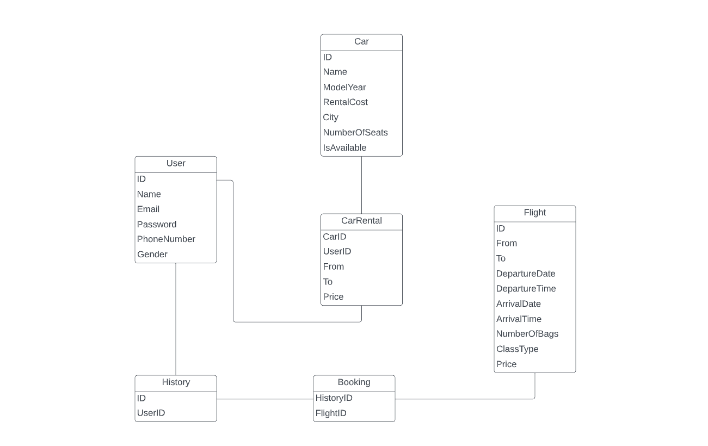
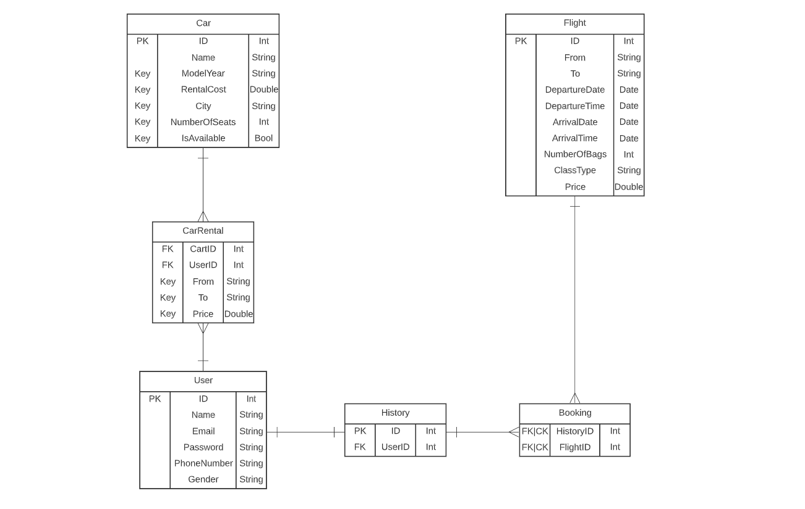
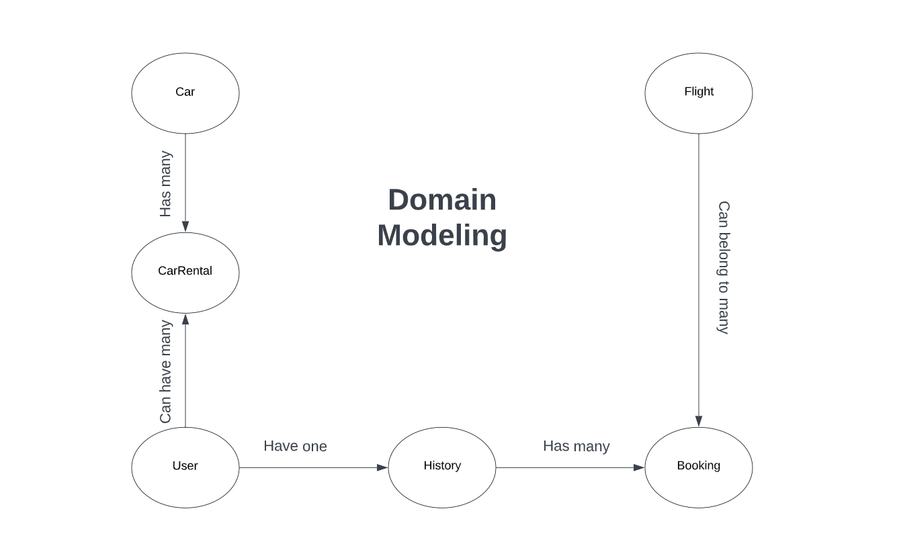

# ***Coders-Airlines***

An airlines website that provides services for people that want to travel arround the world and help them with gettting their preferd flight and much more.

 

## ***Team Members***

1. Laith Alalamat
2. Osama Alzaghal
3. Abdulrahman Jaran
4. Ahmad Masaadeh

 

## ***Project Management Board***

Please follow this link in order to view the project workflow process  [Project Management Tool](https://trello.com/invite/b/YQx4V2m7/ebb758eff23a6104a4e9d658a1845ab3/project-workflow)

 

## ***User Stories***

1. As a user, I would like to have a login page so I can successfully login to my account and browse on my personal account.
2. As a user, I would like to have a sign-up page so I can register an account on the website.
3. As a user, I would like to select a destination and time of the flight so i can browse tha available flights.
4. As a user, I would like to book a ticket with specific details so I can view it in my emails.
5. As a user, I would like to view my tickets on my account so I can check the details about them and view my tickets history

* Complete User Stories: [Click Here](./Documents/User-Stories.md)

 

## Database Schema

 

## Entity Relationship Diagram (ERD)

 

## Domain Modeling

